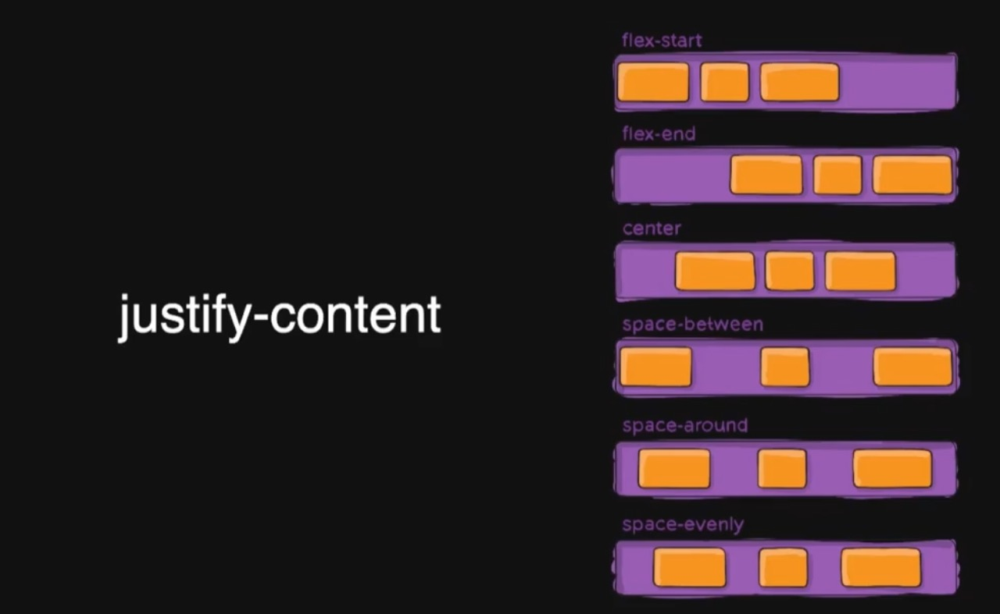
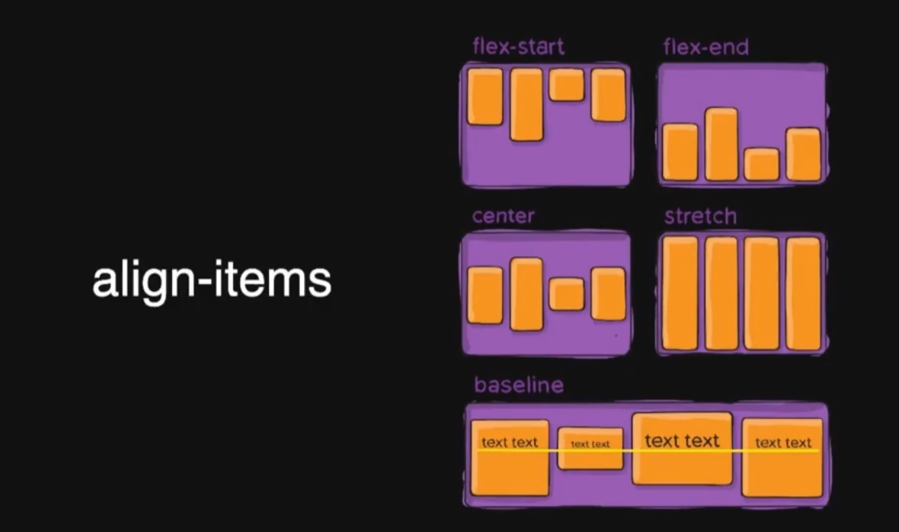

### 使用方式
- 外链 推荐
- 嵌入
- 内联

### 选择器
- 通配选择器
- id选择器
- 标签选择器
- 类选择器 
- 属性选择器 
  - input[type='password'] 
  - a[href$='.jpg'] 表示href属性已.jpg结尾
  - a[href^='#'] 表示a标签href属性已#开头
- 伪类 不基于标签和属性定位元素 
  - 状态伪类 a:link a:hover a:visited a:active :focus ...
  - 结构伪类 li:first-child li:last-child input.error
- 组合
    |    名称    | 语法  |            说明            |    实例     |
    | :--------: | :---: | :------------------------: | :---------: |
    |  直接组合  |  AB   |       满足A同时满足B       | input:focus |
    |  后代组合  |  A B  |   选中B 如果它是A的子孙    |    nav a    |
    |  亲子组合  |  A>B  |  选中B 如果它是A的子元素   | section > p |
    | 兄弟选择器 |  A~B  | 选中B 如果它在A后且和A同级 |   h2 ~ p    |
    | 相邻选择器 |  A+B  | 选中B 如果它紧跟在A的后面  |   h2 + p    |
- 选择器组 使用 , 分隔开

### 颜色
- rgb
- hsl hue 色相(0,360) saturation 饱和度(0-100%) lightness 亮度(0-100%)
- rgba alpha 透明度(0-1)

### 字体 font-family 
- 最好把英文字体放在前面
- 通用字体
  - Serif 衬线体(Georgia,宋体)
  - Sans-Serif 无衬线体(Arial、Helvetica、黑体、微软雅黑)
  - Cursive 手写体(Caflisch Script、楷体)
  - Fantasy (Comic Sans MS , Papyrus)
  - Monospace 等宽字体(Consolas、Courier、中文字体)

### 选择器的特异度
按照 id>伪类>标签来进行排序
|                      | #(id) | .(类) | E(标签) |
| :------------------: | :---: | :---: | :-----: |
| #nav .list li a:link |   1   |   2   |    2    |
|    .hd ul.links a    |   0   |   2   |    2    |

### 属性继承
某些属性会自动继承其父元素的计算值，除非显式指定一个值
- 显式继承

### 初始值
- CSS中，每个属性都有一个初始值
  - background-color的初始值为transparent
  - margin-left的初始值为0
- 可以使用initial关键字显式重置为初始值
  - background-color:initial

### CSS求值过程

计算值：浏览器在分析CSS，HTML代码后可以直接计算得到的值
使用值：进行实际布局时使用的值，比如100%这种属性就需要根据浏览器的具体属性来计算

### 布局(Layout)是什么
- 确定内容的大小和位置的方法
- 依据元素、容器、兄弟节点和内容等信息来计算

### 布局相关技术
- 常规流
  - 根元素、浮动和绝对定位的元素会脱离常规流
  - 其他元素都在常规流之内(in-flow)
  - 常规流中的盒子，在某种**排版上下文**中参与布局
  - 行级
  - 块级
  - 表格布局
  - FlexBox
  - Grid布局
- 浮动
- 定位

### 盒模型
- width
  - 指定 content box 宽度
  - 取值为 **长度** 、**百分数**、**auto**
  - auto由浏览器根据其他属性决定
  - 百分数相对于容器的content box 宽度
- height
  - 指定 content box 高度
  - 取值为 **长度** 、**百分数**、**auto**
  - auto 取值由内容计算得来
  - 百分数相对于容器的content box 高度
  - **容器有指定高度时，百分数才生效**
- padding
  - 指定元素四个方向的内边距
  - 百分数相对于容器宽度
  - 值为 上 右 下 左
- border
  - 指定容器边框样式、粗细和颜色
  - 四条边框颜色不同时，在交界处是斜着交汇的
   
  - 可以通过把其他边框的颜色透明度改为0来获得一个三角形
- margin
  - 指定元素四个方向的外边距
  - 取值可以是**长度** 、**百分数**、**auto**
  - 百分数相对于容器**宽度**
  - margin auto 可以水平居中
  - margin 在垂直方向上的边距不会是几个元素的margin值之和，而是取这几个元素之间最大的值
- box-sizing:border-box
  - 这个属性的宽度包括了border和padding这两个属性
  - 普通的盒模型这些属性是分开的，宽度就是宽度
- overflow
  - visible 超出盒子的也展示
  - hidden 超出盒子的内容就隐藏
  - scroll 超出盒子的内容隐藏，但可以滚动查看
  - auto 超出就滚动，不超出就不变

### 块级和行级
- 块级盒子和行级盒子
  |       块级盒子       |                行级盒子                |
  | :------------------: | :------------------------------------: |
  | 不和其他盒子并列摆放 | 和其他行级盒子一起放在一行或拆开成多行 |
  | 适用所有的盒模型属性 |   盒模型中的width、height属性不适用    |
- 块级元素和行级元素
  |                       块级元素                       |            行级元素            |
  | :--------------------------------------------------: | :----------------------------: |
  |                     生成块级盒子                     |          生成行级盒子          |
  | body、article、div、main、section、h1-6、p、ul、li等 | span、em、strong、cite、code等 |
  |                    display:block                     |         display:inline         |
- display属性
  - block 块级盒子
  - inline 行级盒子
  - inline-block 本身是行级，可以放在行盒子中；可以设置宽高；作为一个整体不会被拆散成多行
  - node 排版时被完全忽略

### 行级排版上下文
-  inline Formatting Context(IFC)
-  **只包含行级盒子**的容器会创建一个IFC
-  IFC内的排版规则
   -  盒子在一行内水平摆放
   -  一行放不下时，换行显示
   -  text-align决定一行内盒子的水平对齐
   -  vertical-align决定一个盒子在行内的垂直对齐
   -  **避开浮动(float)元素**

### 块级排版上下文
- Block Formatting Context(BFC)
- 某些容器会创建一个BFC
  - 根元素
  - 浮动、绝对定位、inline-block
  - Flex子项和Grid子项
  - overflow值不是visible的块盒
  - display:flow-root
- BFC内的排版规则
  - 盒子从上到下摆放
  - 垂直margin合并
  - BFC内盒子的margin不会与外面的合并
  - BFC不会和浮动元素重叠

### Flex Box
- 一种新的排版上下文
- 它可以控制子级盒子的
  - 摆放的流向(→ ← ↑ ↓ )
  - 摆放顺序
  - 盒子宽度和高度
  - 水平和垂直方向的对齐
  - 是否允许换行
- flex-direction 方向
   
- justify-content 主轴(水平)
   
- align-items 侧轴(垂直)
   
- align-self 可以针对某个元素设置成别的对齐方式
   
- order
   
- Flexibility 弹性
  - 可以设置子项的弹性:当容器有剩余空间时，会伸展；容器空间不够时，会压缩
  - flex-grow 有剩余空间时的伸展能力
   
   这里的2和1并不是宽度变成2:1，而是在容器有剩余空间的时候，这些空间按照2:1的比例分配到a元素和b元素身上
  - flex-shrink 容器空间不足时收缩的能力
  - flex-basis 没有伸展或收缩时的基础长度
  - flex的缩写都代表什么
     |                |                                              |
     | :------------: | :------------------------------------------: |
     |     flex:1     |                 flex-grow:1                  |
     |   flex:100px   |               flex-basis:100px               |
     |    flex:2 1    |         flex-grow : 2; flex-shrink:1         |
     |  flex:1 100px  |       flex-grow : 1; flex-basis:100px        |
     | flex:2 0 100px | flex-grow:2; flex-shrink:0; flex-basis:100px |
     |   flex:auto    |                flex:1 1 auto                 |
     |   flex:none    |                flex:0 0 auto                 |

### Grid布局
- display:grid 使元素生成一个块级的Grid容器
- 使用grid-template相关属性将容器划分为表格
- 设置每一个子项占哪些行/列
- 划分网格 fr可以理解成是份
    
    
- grid line 网格线
   
  
  

### float 浮动
现如今flex和grid等布局方式出现后，float基本只用来实现图文环绕的功能了

### 定位
- position属性
   |          |                                    |
   | :------: | :--------------------------------: |
   |  static  |         默认值，非定位元素         |
   | relative | 相对自身原本位置偏移，不脱离文档流 |
   | absolute | 绝对定位，相对非static祖先元素定位 |
   |  fixed   |         相对于视口绝对定位         |
- relative属性
   
- absolute属性
  - 脱离常规流
  - 相对于**最近的非static祖先**定位
  - 不会对流内元素布局造成影响